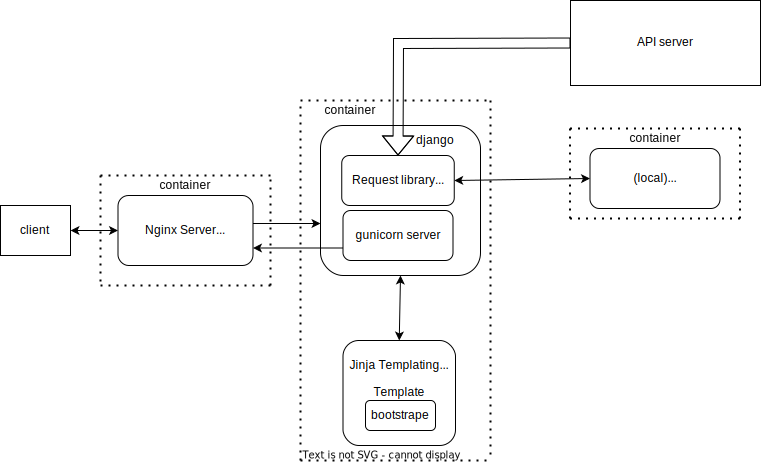

# A hacker-News client using Algolia Search's API for Hacker News

Utilises API which built on top of Algolia Search's API for Hacker News,
HN Search(Algolia Search's API) provides real-time full-text search for the HackerNews 
community site, it's search backend is implemented using Algolia instant search engine.

## Explaination

The client has visually clear containerized posts, usefull when we want to remain updated
about latest news, eventho hacker news is not a proper news site, but still its better
platform to remain updated about tech updates, 

### Redis

It utilises redis cache so it won't burden server for normal actions,
and increase response time, redis cache expires in around 1 minutes, till
newer posts gets updated, cache applies when getting latest posts.

### Containerisation

The applications are containerised in indivisual docker conatainers,
for django and nginx(dockerfile), and offical redis image, handled
together by docker compose. 
    Where nginx is connected to frontend network (docker networking), 
while django and redis are connected to backend network, nginx is 
serving simple reverse proxy, django server serves it on port 8000. 

### Key points

1. Can view posts in bit visual UI.
2. Mostly focused on latest posts, to remain updated.
3. Redis cache is utilised to cache posts for certain time interval 
- approximatly till new posts get updated.
- It reduces number of server requests.
- Makes response time faster.
4. Utilized nginx as simple reverse proxy server to hide direct access.
5. Containerition of django, nginx and redis to handle complex dependencies.

## Explainatory diagram



## Instructions 

### python
---

**Python 3.8**

(for linux)
```
sudo apt install python3-pip
```
```
sudo apt install python3.8-venv
```

**Venv**

creating-
```
python3 -m venv env
```
activating-
```
source env/bin/activate
```
### docker
---

**To install docker**

(Using curl)

install curl-
```
sudo apt install curl
```
get convineint script using curl-
```
curl -fsSL https://get.docker.com -o get-docker.sh
```
execute the script-
```
sudo sh get-docker.sh
```
### docker compose standalone
---

**Installing Docker Compose standalone**

(Using curl)
```
sudo curl -SL https://github.com/docker/compose/releases/download/v2.15.1/docker-compose-linux-x86_64 -o /usr/local/bin/docker-compose
```
give the sudo permission to get it.

**Apply executable permissons**
```
sudo chmod +x /user/local/bin/docker-compose
```
Compose standalone uses the -compose syntax instead of 
the current standard syntax compose.

**Test and execute compose commands using docker-compose**

for example-
```
docker-compose --version
```

**To indivisually  install requirements**
```
 pip3 install -r requirements.txt
```
### Using only dockerfile
---

**Create docker image using single dockerfile**
```
sudo docker build -t image_name .
```
**Run it**
```
sudo docker run -p 8000:8000 image_name
```

### Gunicorn server
---

**Running gunicorn server**
```
gunicorn projectname.wsgi:application --bind 0.0.0.0:8000 
```

### docker compose
---

(which can handle everything, once defined)

**To build images via docker compose**
```
sudo docker compose build
```
**To run docker images**
```
sudo docker compose up
```

## Normal installation

(of dependencies)

**For installing djnago**
```
pip install django
```
**Install request library**
```
pip install requests
```
**Installing redis library**
```
pip install redis
```
**Install gunicorn**
```
pip install gunicorn
```
**Django runserver**
```
python manage.py runserver
```

## Known issues

1. Its been hard to parse paragraf tags comming from api, i have used django 
template filters and other things to make it parse, but i don't know yet
what more can be done.

2. UI is still not perfect since i didn't used much of frontend technologies,
and my lack of knowledge this portion.

3. Redis cache only helps in lastest posts, we have to still have to
request server in case of getting perticular post.